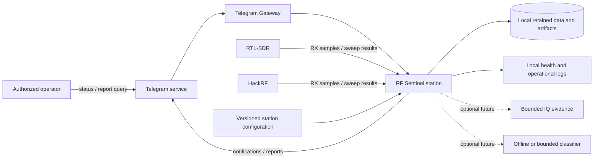
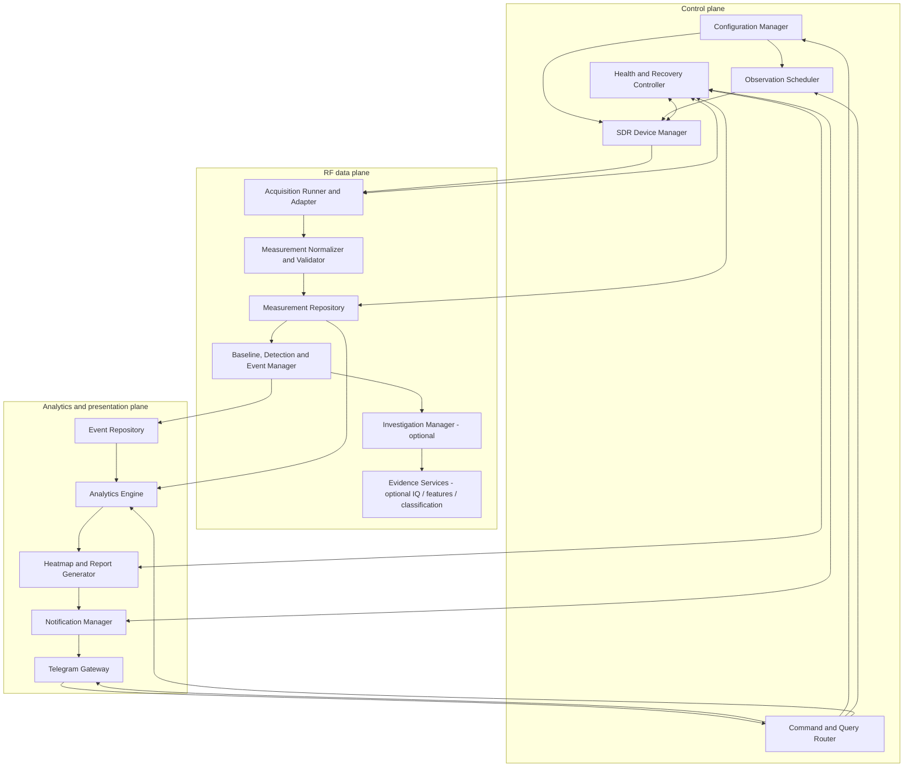
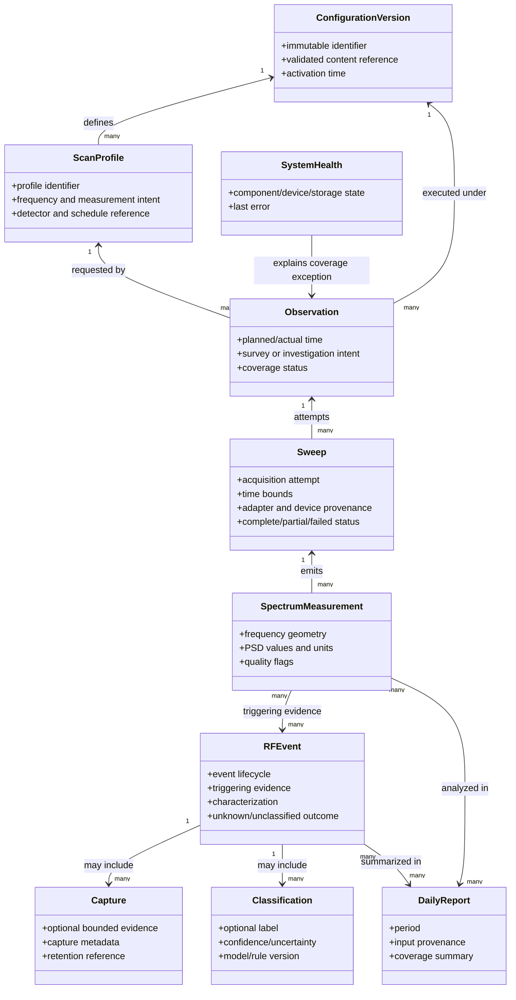
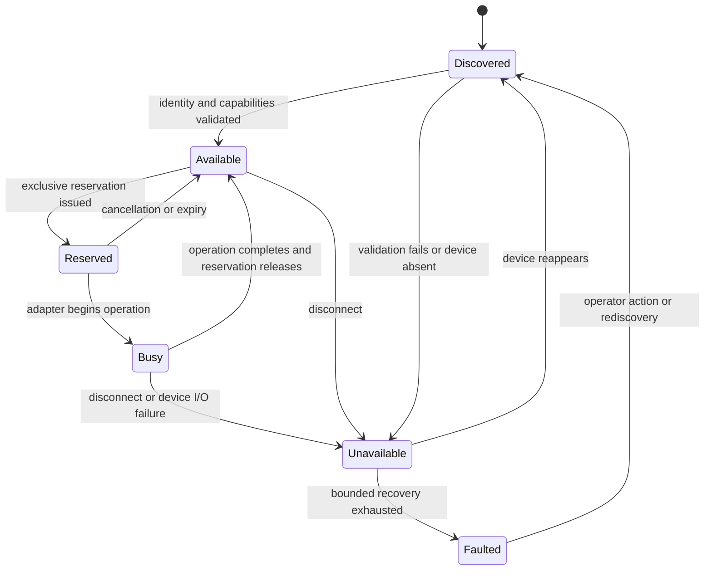
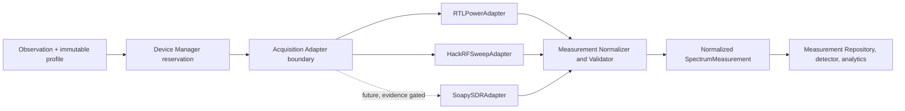
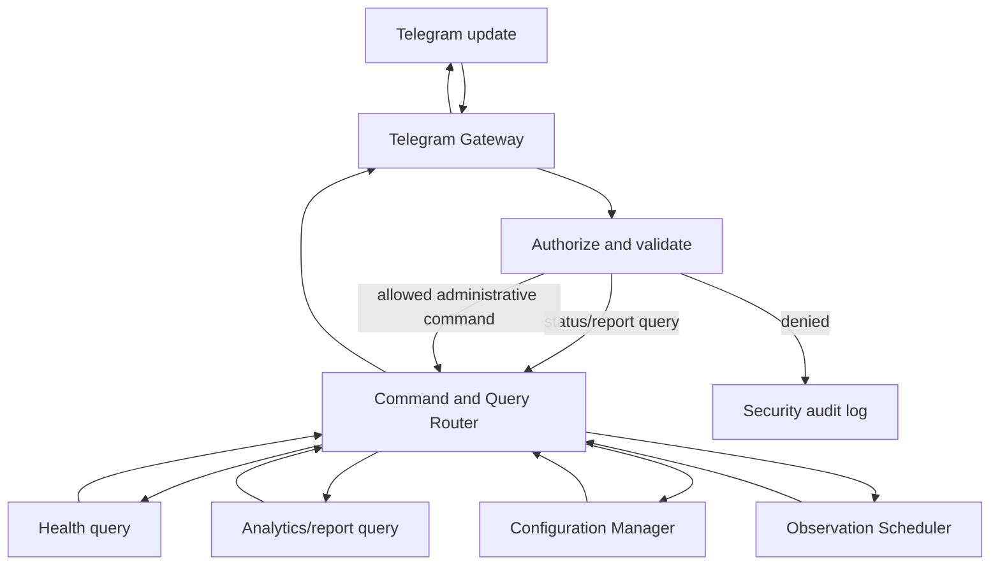
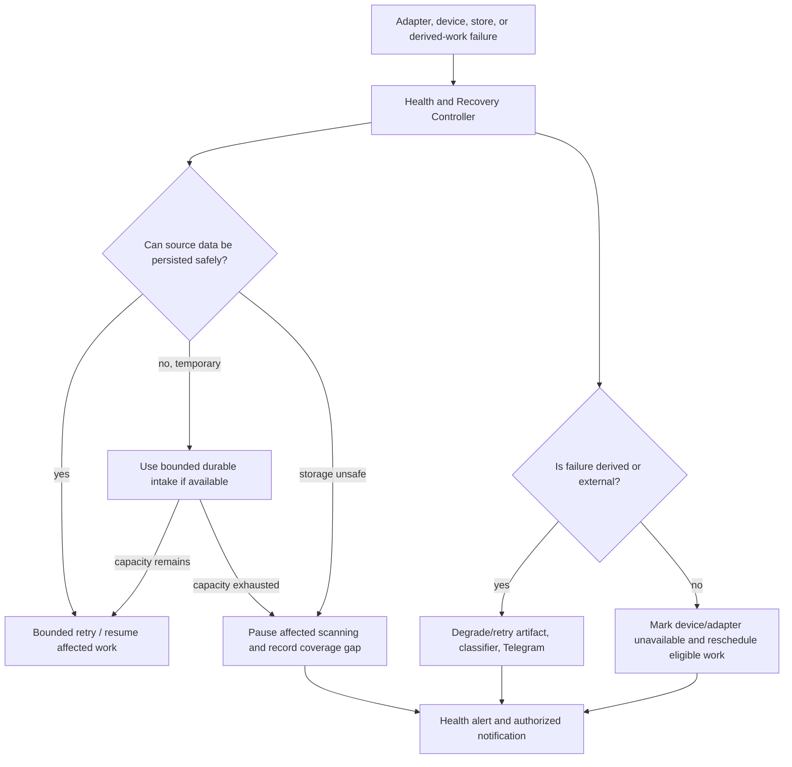

# RF Sentinel — Initial System Architecture

## Scope and decision status

This is the initial architecture for an unattended, RX-only spectrum-observation station on Raspberry Pi Compute Module 4 (CM4), Linux ARM64. It implements the requirements in [REQUIREMENTS.md](REQUIREMENTS.md) as responsibility boundaries and contracts, not application code, package structure, database schema, or final technology selection.

`rtl_power` and `hackrf_sweep` are the first acquisition baseline candidates, not permanent dependencies. CM4 performance, device behavior, storage capacity, recovery timing, and future SoapySDR adoption remain subject to [hardware experiments](research/EXPERIMENTS.md). Decision status and evidence gates are recorded in [DECISIONS.md](DECISIONS.md); unresolved questions are in [ARCHITECTURE_QUESTIONS.md](ARCHITECTURE_QUESTIONS.md).

## Architecture goals

- Continuously and/or on schedule observe configured spectrum ranges with RTL-SDR and HackRF devices in RX-only mode.
- Preserve measurement provenance, coverage state, events, and sufficient evidence for reproducible history, reports, and operator review.
- Keep RF acquisition operable when presentation, reporting, classification, or external connectivity fails.
- Prevent competing control of a physical SDR and recover safely from device and tool failure.
- Treat missing coverage as distinct from quiet spectrum.
- Permit future bounded IQ investigation, classification, extra SDR types, and internal process separation without redesigning the event model.
- Keep Telegram as an authorized external interface, never an RF-device or shell-control path.

## Architecture principles

1. **RX-only, content-agnostic operation.** The architecture never requires transmission, protected-content decoding, access-control bypass, or private-content processing.
2. **Configuration and provenance are first-class.** Every observation, measurement, event, capture, and derived result identifies its configuration version and relevant producer version.
3. **Normalize at the acquisition edge.** Downstream policy sees a stable measurement contract rather than tool-specific CSV/text/binary details.
4. **Persist source facts before producing conclusions.** Measurements and coverage outcomes are authoritative inputs; events, statistics, images, and reports are explained by retained inputs and versions.
5. **Explicit ownership and bounded resources.** SDR reservations, storage buffers, capture limits, retries, and notification queues have owners and bounds. No component may assume infinite disk, memory, or retry capacity.
6. **Degrade deliberately.** Derived work may be retried or dropped before RF source data; when source persistence cannot be protected, scanning pauses safely and records a coverage gap rather than silently losing meaning.
7. **Unknown is valid.** An unrecognized signal stays unknown/unclassified. Classification is optional evidence, not an assertion of content, source, or identity.
8. **Test without hardware where possible.** Replay and synthetic inputs cross the same normalized boundaries as live acquisition. Hardware tests remain necessary for device and CM4 behavior.
9. **Simple runtime, separable responsibilities.** Logical components have narrow interfaces now; only demonstrated fault-isolation or scale needs justify additional services.

## System context



The station is the system of record for observations and events. Telegram is an external, untrusted transport boundary. SDRs are receive-only peripherals, not general-purpose services.

## Architectural planes

Planes are responsibility boundaries. The selected initial runtime model does not require one operating-system process per plane.

| Plane | Responsibility | Owns | Must not own |
| --- | --- | --- | --- |
| **RF data plane** | Observe spectrum, normalize measurements, estimate baseline, detect activity, create/characterize events, and optionally gather focused evidence. | SDR reservations while active; acquisition-attempt state; normalized measurement validity; detector evidence. | User authorization, report delivery, final storage technology, or Telegram transport. |
| **Control plane** | Validate/configure system behavior, schedule observations, assign devices, coordinate state, expose health, and apply recovery policy. | Configuration activation/version, schedule intent, device inventory/reservations, command outcomes, health state. | PSD algorithm implementation, raw device access outside a reservation, or report content. |
| **Analytics / presentation plane** | Query retained source/domain data; calculate occupancy/statistics; generate heatmaps/reports; present status/reports; deliver notifications. | Derived artifact generation records; query views; notification delivery attempts. | SDR ownership, direct hardware calls, direct mutation of source measurement records, or authorization bypass. |

## Major components

### Component map



The accepted components below are logical. “Repository” means an authoritative persistence boundary, not a database product. Optional components remain disabled until the relevant policy, storage, and CM4 evidence gates are met.

### Control-plane components

| Component | Purpose and responsibilities | Inputs → outputs | Owned state | Dependencies and interfaces | Failure modes and recovery |
| --- | --- | --- | --- | --- | --- |
| **Configuration Manager** | Validates, versions, activates, and audits configuration: scan profiles, schedules, detector settings, storage policy, authorization, and recovery policy. Retains the last known valid active version. | Proposed configuration and authorized commands → validation result, immutable configuration version, activation/change event. | Active version, version history, validation/audit outcome. | Receives administrative commands from Command and Query Router; publishes immutable version references to Scheduler, Device Manager, acquisition, analytics, and gateways. | Invalid/missing configuration: reject and retain last valid version; record error. Configuration-store failure: deny mutation, continue only with already active valid version, raise health state. |
| **Observation Scheduler** | Converts active schedules and scan profiles into planned survey observation requests; tracks planned, started, completed, missed, and cancelled coverage. It does not touch SDRs. | Active profiles/schedules, clock state, device availability → observation request, coverage outcome, missed-scan reason. | Schedule evaluation cursor and observation execution state. | Requests reservation through Device Manager; sends work to Acquisition Runner; publishes coverage to Measurement Repository and health. | Clock anomaly, unavailable device, invalid profile, queue saturation: do not invent observations; record missed/deferred coverage with reason; retry according to policy after prerequisites recover. |
| **SDR Device Manager** | Discovers devices; maintains physical identity, capability records, availability, reservations, assignments, and lifecycle transitions; validates profiles before device use. It is the sole issuer of device-control authority. | OS/device discovery, profile capability request, reservation/release request, adapter lifecycle signal → capability validation, lease/reservation, device state, recovery action. | Device inventory, stable identity mapping, capabilities, reservation token, busy/fault state. | Scheduler and Investigation Manager request reservations. Acquisition Runner receives only a valid reservation. Health/Recovery Controller consumes transitions. | Disconnect, startup absence, capability mismatch, stale reservation: move to unavailable/faulted, revoke/expire ownership, notify health; rediscover/revalidate before a new reservation. Never assign a device twice. |
| **Health and Recovery Controller** | Aggregates component/device/storage/coverage health; applies bounded retry/backoff policy; decides degraded, paused, or operator-attention states; emits actionable health changes. | Component heartbeats/outcomes, device state, storage state, service lifecycle → health snapshot, recovery command, alert condition. | Current and historical health state; retry counters; recovery episode state. | Observes all components; asks Device Manager/Scheduler/Acquisition Runner to recover through their interfaces; sends alert requests to Notification Manager. | Itself unavailable: service supervisor detects lack of liveness and restarts the station. Repeated failed recovery: stop retry storm, preserve evidence, mark persistent failure, notify authorized operator. |
| **Command and Query Router** | Converts authenticated internal or external requests into explicit domain commands/queries; enforces command type and authorization context; does not execute shell or device operations. | Authorized request context and command/query → typed result, audit outcome, domain command/query. | Command idempotency/audit correlation as required; no SDR state. | Telegram Gateway invokes it; it calls Configuration Manager, Scheduler, Health, Analytics, and report query interfaces. | Invalid/unauthorized request: deny, audit, return safe error. Downstream unavailable: return bounded unavailable result; never bypass component ownership. |

### RF-data-plane components

| Component | Purpose and responsibilities | Inputs → outputs | Owned state | Dependencies and interfaces | Failure modes and recovery |
| --- | --- | --- | --- | --- | --- |
| **Acquisition Runner and Adapter** | Executes an assigned observation only under a Device Manager reservation. The adapter invokes a selected acquisition implementation and translates its lifecycle/output. Initial implementations may supervise `rtl_power` and `hackrf_sweep`; future adapters may use SoapySDR or native APIs. | Observation request, reservation, immutable profile/configuration → raw acquisition result, normalized-candidate records, execution status. | Per-attempt process/stream state, adapter/tool version, cancellation state; never long-term domain authority. | Receives only Scheduler/Investigation work and Device Manager reservation; emits candidates to Normalizer; reports lifecycle to Health and Device Manager. | Tool crash/hang, device error, malformed output, cancellation: terminate/reap safely, release reservation, emit a failed/partial execution outcome, retry only through recovery policy. No raw output reaches detection without validation. |
| **Measurement Normalizer and Validator** | Validates tool/API output and converts it to the device-neutral SpectrumMeasurement contract. Rejects ambiguous units, malformed geometry, missing mandatory provenance, or unparseable values. | Raw adapter output plus observation/reservation/configuration context → valid normalized measurement(s), rejected-record diagnostic, quality/coverage flags. | Validation rule/version; bounded parsing/diagnostic state. | Called by Acquisition Runner; writes valid data through Measurement Repository; signals Health and Scheduler on rejected/partial results. | Malformed or incompatible result: reject that record/sweep, retain bounded diagnostic evidence, create coverage/quality outcome; do not fabricate bins or values. Repeated failures escalate to adapter recovery. |
| **Measurement Repository** | Owns authoritative persistence and retrieval of SpectrumMeasurements and observation/sweep coverage records. Enforces retention and bounded intake behavior. | Valid measurements, observation/sweep outcomes, retention policy → durable source records, retrieval/query results, pressure state. | Measurement/coverage records, ingestion outcome, retention bookkeeping; final storage implementation is deferred. | Receives only normalized data; serves Baseline/Detection and Analytics; publishes storage health. | Temporary persistence fault: use only a bounded, durable intake buffer if available; otherwise pause affected acquisition and record gap. Capacity pressure: remove eligible derived/expired data per policy; storage full with no safe reclaim pauses source acquisition and alerts. |
| **Baseline, Detection and Event Manager** | Computes documented baseline/noise context from persisted or accepted measurements, evaluates configured activity rules, creates RFEvents, and derives non-content characterization. Keeps unknown events valid. | Valid measurements and coverage, detector configuration/version → baseline result, detection evidence, RFEvent create/update request, characterization. | Detector episode state and baseline state scoped by compatible observation context; rule/version provenance. | Reads from Measurement Repository; writes domain events via Event Repository; may request optional investigation through Investigation Manager. | Insufficient coverage/baseline, algorithm exception, invalid detector config: emit no invented event; record analysis unavailable/failed; preserve measurements; retry derived analysis without blocking acquisition. |
| **Event Repository** | Owns authoritative RFEvent records, immutable triggering provenance references, subsequent evidence links, annotations, and event query order/filter semantics. | Event create/update/annotation requests → persisted RFEvent and event-history queries. | RFEvent lifecycle and append-only evidence/annotation relationships. | Used by Baseline/Detection, Investigation, Evidence Services, Analytics, authorized annotation commands. | Repository unavailable: do not claim event committed; boundedly queue only if durable policy permits, otherwise preserve measurement and mark pending analysis. Recover/replay idempotently from source data where possible. |
| **Investigation Manager** *(optional capability)* | Coordinates a focused observation triggered by an RFEvent or authorized request. It applies priority/policy, requests an SDR reservation, and attaches only additional evidence to the existing event. | RFEvent plus investigation policy/request → investigation plan, focused observation request, investigation outcome/evidence links. | Investigation request/lifecycle state; no direct device ownership. | Device Manager, Acquisition Runner, Measurement/Event Repositories, Evidence Services. | No device/capability, priority conflict, failed focused acquisition: record investigation outcome and preserve parent event; never discard survey evidence or silently preempt without policy. |
| **Evidence Services: IQ Capture, Feature Extraction, Classifier** *(optional capability)* | Collects bounded, explicitly enabled IQ evidence; produces derived features and optional classification with model/rule/dataset version, confidence/uncertainty, and unknown outcome. | Authorized investigation context and capture/classifier policy → Capture record, feature artifact, Classification record linked to RFEvent. | Capture lifecycle and derived-result status. Raw IQ remains separately retained evidence. | Invoked only by Investigation Manager; uses a valid device reservation; stores capture through artifact boundary and event link via Event Repository. | Disk/policy violation, classifier crash, invalid model/result: stop/omit optional work, record failure/unknown, retain parent event; never block survey or claim a classification. |

### Analytics / presentation components

| Component | Purpose and responsibilities | Inputs → outputs | Owned state | Dependencies and interfaces | Failure modes and recovery |
| --- | --- | --- | --- | --- | --- |
| **Analytics Engine** | Calculates reproducible statistics, occupancy, coverage summaries, event queries, and daily reporting inputs from retained source/domain data. | Measurement/coverage records, RFEvents, config/algorithm versions → statistics, query result, report input set and provenance. | Aggregation/version/run state; derived values are recomputable where retained inputs exist. | Reads Measurement and Event Repositories plus configuration reference; serves Command and Query Router and artifact generation. | Query/aggregation failure: mark derived request failed, retain inputs, retry/queue boundedly; no effect on acquisition. Missing source data is represented as unavailable coverage, never quiet spectrum. |
| **Heatmap and Report Generator** | Creates derived heatmaps and daily reports from analytics outputs, records the input range/version/coverage and generation result, and makes artifacts retrievable. | Analytics result, report schedule/request → versioned heatmap/report artifact and generation status. | Derived artifact metadata and generation job state; not authoritative source facts. | Invoked by Analytics/Scheduler policy; artifacts delivered by Notification Manager/Telegram Gateway. | Rendering/generation failure: retry as derived work, record failure/coverage limitation, alert when configured; never halt acquisition or alter source records. |
| **Telegram Gateway** | Implements Telegram transport boundary: verifies authorized identity/context, maps supported commands to Command and Query Router, renders safe responses, and carries outbound messages. | Telegram update / outbound delivery request → typed query/command or delivery outcome. | Minimal transport/update deduplication state; credentials are secret-managed and never exposed. | Only talks to Command and Query Router and Notification Manager; has no SDR, store-write, shell, or scheduler ownership. | Telegram/network unavailable: report transport health; no effect on scan/acquisition. Unauthorized update: deny and audit. |
| **Notification Manager** | Applies notification policy, suppression/aggregation, bounded delivery queue, and delivery attempts for operational and scheduled-report conditions. | Health condition, report-ready request, policy → notification request/delivery record. | Notification deduplication, suppression, bounded queue, delivery outcome. | Sends only through Telegram Gateway initially; reads policy/version from Configuration Manager. | Transport failure: retain bounded delivery outcome/retry queue; log/health report failures; drop expired derived notification according to policy rather than consume source-data capacity. |

## Central domain model

`RFEvent` is the central *noteworthy-activity* entity. It is not the central record for all RF data: SpectrumMeasurements and coverage records remain authoritative observations. An RFEvent links the evidence and outcomes that explain why an activity episode is noteworthy.



| Entity | Domain responsibility and relationship |
| --- | --- |
| **ConfigurationVersion** | Immutable validated reference for behavior. Every generated record references the applicable version, avoiding ambiguity after changes. |
| **ScanProfile** | A versioned observation intent: range(s), measurement settings, detection policy, selected/eligible device and schedule association. It is not a device command. |
| **Observation** | A planned and then actual unit of survey or investigation work. It records intent, time basis, assignment outcome, and coverage state—including skipped/deferred/failed—whether or not measurements result. |
| **Sweep** | One concrete acquisition attempt within an Observation. For a tuning/sweep tool it may span several tune segments. It records adapter/tool/device provenance, time bounds, and complete/partial/failed result. |
| **SpectrumMeasurement** | Normalized, timestamped factual PSD/spectrum record with frequency geometry, values/units, quality/coverage flags, Observation/Sweep links, SDR provenance, profile, and configuration version. It never substitutes an absent measurement with zeros. |
| **RFEvent** | A bounded episode of activity created from detector evidence. It references triggering measurements/sweeps, time/frequency context, baseline/detector criterion/version, SDR/profile/configuration provenance, characterization, and append-only investigation/capture/classification/annotation links. |
| **Capture** | Optional bounded evidence generated only under policy, normally a short IQ capture with self-describing metadata and a link to its RFEvent/investigation. It is not required for an event. |
| **Classification** | Optional derived assessment linked to an RFEvent or capture. It has label/category or unknown, confidence/uncertainty, producer/model/rule/dataset version, input reference, and outcome/failure state. |
| **DailyReport** | Derived artifact for a defined reporting period. It references report definition, input query/range, configuration/analytics versions, coverage caveats, and generated artifact. |
| **SystemHealth** | Time-scoped operational state for service, devices, storage, acquisition, external interfaces, and last material errors. It explains, but does not alter, source observations. |

## SDR ownership model

Only the SDR Device Manager may grant a reservation. Every live acquisition or optional capture needs a reservation bound to a physical device identity, capability validation result, intended operation, owner, and expiry/cancellation conditions.



- **Discovery and identity:** Inventory uses a stable hardware identifier where the device exposes one, plus observed device characteristics and connection path as supporting context. A transient OS path or friendly label is not sufficient as sole identity. The exact Linux/udev identity mechanism is unresolved.
- **Availability and capability validation:** Availability means present, permitted, not faulted, and not reserved. Before reservation, Device Manager validates profile-required frequency range, acquisition mode, required settings, and investigation needs against the recorded capabilities; it does not assume RTL-SDR and HackRF parity.
- **Reservation and assignment:** A Scheduler or Investigation Manager requests a device for a stated observation. The manager atomically chooses one eligible available device, issues one lease token, records assignment, and marks it Reserved. The Adapter receives a token but cannot independently select a device.
- **Busy and release:** Adapter start changes Reserved to Busy. Completion, cancellation, crash cleanup, or lease expiry causes child-process/stream termination first, then release. A reservation cannot be shared between survey and investigation.
- **Failure and reconnect:** Disconnect revokes the reservation and causes the associated Sweep/Observation to end partial or failed with explicit coverage reason. Reappearance returns through discovery and capability validation; it never automatically inherits a stale process or reservation.
- **Multiple SDRs:** The model supports concurrent reservations only for distinct devices. Whether concurrent operation is enabled in a deployment is a CM4 USB/power/resource decision, not implied by the model.

## Acquisition abstraction

### Adapter boundary



An adapter owns implementation-specific process/API lifecycle and raw parsing only. It must not decide event policy, write directly to analytics/event storage, call Telegram, or access another device. Adapters are replaceable behind the same contract. A profile selects an adapter capability class, not a hard-coded program name, so later replacement does not alter downstream behavior.

### Normalized SpectrumMeasurement contract

The contract is conceptual and schema-free at this stage. A valid record requires:

| Contract group | Required content | Rules |
| --- | --- | --- |
| Identity and provenance | Measurement identifier; Observation and Sweep identifiers; acquisition adapter and version; physical SDR identity; ScanProfile identifier; ConfigurationVersion identifier. | All references must be present and consistent. Producer-specific details may be retained as namespaced diagnostic metadata, not interpreted downstream as common fields. |
| Time and coverage | Measurement timestamp/time basis; acquisition start/end when known; planned versus actual coverage context; complete/partial/failed/unknown quality status. | Tool timestamp and station receipt time remain distinguishable. A missing or rejected measurement creates coverage metadata, not a synthetic spectrum row. |
| Frequency geometry | Start/stop or center/span; ordered bin geometry/step/count; usable versus excluded bins when known. | Units and bin meaning are explicit. The normalizer rejects inconsistent geometry rather than silently resampling or guessing. |
| Values and acquisition context | PSD/spectral power values; explicit unit/reference; integration/sample-count/exposure metadata when available; gain/mode/settings actually applied when available. | Unknown fields stay unknown. “dB” without an established reference is preserved with its declared semantics and is not promoted to calibrated power. |
| Quality and diagnostics | Validation result, clipping/overrun/drop/retune/edge flags when exposed, raw-source correlation, adapter error category. | Quality flags travel with data to baseline, detection, statistics, and reports. They prevent questionable observations from being silently treated as normal coverage. |

The Measurement Repository also receives a Sweep/Observation execution outcome even when no normalized measurement is valid. This preserves coverage semantics. Any optional raw tool output has bounded diagnostic retention and is not the authoritative data contract.

## Survey and investigation model

**Survey** is the normal scheduled or continuous operation. It produces Observation/Sweep coverage records, normalized SpectrumMeasurements, detection candidates, historical inputs, and RFEvents. It is driven by scan profiles and scheduling policy.

**Investigation** is an optional, policy-controlled focused observation triggered by an RFEvent or an authorized request. It may produce higher-resolution spectrum data, a short bounded IQ Capture, spectrogram, additional characterization, features, and optional classification. It does not replace the original triggering evidence.

```mermaid
sequenceDiagram
  participant S as Survey Scheduler
  participant D as Device Manager
  participant A as Acquisition Adapter
  participant E as Event Manager
  participant I as Investigation Manager
  participant H as Optional Investigation SDR

  S->>D: reserve survey SDR
  D->>A: reservation + observation
  A->>E: normalized measurements and detector input
  E->>E: create RFEvent with provenance
  opt future policy permits investigation
    E->>I: investigation request linked to RFEvent
    I->>D: reserve eligible investigation SDR
    D->>H: exclusive focused assignment
    H-->>I: focused measurement / bounded capture outcome
    I->>E: append evidence links; retain original event
  end
```

- A Survey SDR and Investigation SDR may be different physical devices; they may be the same only if no conflicting reservation exists and explicit policy permits a coverage interruption.
- The first MVP does not require Investigation, second SDRs, IQ capture, or classification. The event model accepts these links later.
- Investigation priority, survey preemption, capture duration/retention, and authorization are unresolved policy questions. Default architecture intent is **no silent survey preemption**.

## Primary data flow

```mermaid
flowchart LR
  SDR[Reserved SDR] --> AD[Adapter]
  AD --> NV[Normalize and validate]
  NV -->|valid source record| MR[Measurement Repository]
  NV -->|rejected or partial outcome| CV[Coverage / quality record]
  CV --> MR
  MR --> BE[Baseline estimation]
  BE --> DET[Activity detection]
  DET -->|evidence-linked activity| ER[Event Repository / RFEvent]
  MR --> AN[Analytics Engine]
  ER --> AN
  AN --> HM[Heatmaps]
  AN --> DR[Daily reports]
  HM --> ART[Derived artifact store]
  DR --> ART
  ART --> TG[Telegram on-demand/delivery]
```



1. Scheduler creates a Survey Observation, Device Manager reserves a capable SDR, and the Adapter performs a bounded acquisition attempt.
2. Normalizer validates the attempt. Valid measurements and all coverage outcomes persist through the Measurement Repository before detector conclusions are committed.
3. Baseline/Detection evaluates compatible valid measurements. It emits evidence-linked RFEvent create/update requests; insufficient coverage is expressed as analysis limitation.
4. Analytics reads retained source and domain records to calculate statistics/occupancy and produce derived heatmaps/reports with source scope and versions.
5. Telegram delivers authorized queries and notifications only after internal query/command and artifact boundaries.

### Asynchronous boundaries and backpressure

- Acquisition-to-normalization, normalization-to-persistence, derived analytics, artifact generation, and notification delivery are asynchronous work boundaries. They may initially be in-process queues/tasks, not a message broker.
- Each queue has bounded capacity, owner, overload behavior, metrics, and a correlation identifier. The precise implementation is deferred.
- Source-measurement intake prefers bounded durable buffering. If that guarantee cannot be maintained, Scheduler pauses affected acquisition and records a coverage gap rather than dropping unmarked measurements.
- Analytics, heatmaps, reports, classification, and Telegram notifications are lower priority than source acquisition. Their overload may coalesce, defer, retry, or drop obsolete derived work according to policy.
- A broker is not selected: one CM4 station and a small number of local responsibility boundaries do not yet justify broker lifecycle, persistence, and deployment complexity.

## Control flow and Telegram boundary



- Telegram has no direct SDR access, device reservation, subprocess ownership, shell execution, measurement-store write interface, or privileged configuration-file access.
- Telegram Gateway authenticates/authorizes Telegram identity before asking Command and Query Router to execute a named allowed command/query. Read-only status and report retrieval are required; configuration-changing commands require distinct authorization and audit, and may remain unavailable in the first MVP.
- Outbound notifications are requests from Notification Manager, not direct component calls to Telegram. Delivery failure is visible locally and in SystemHealth without affecting RF acquisition.

## Data ownership and persistence boundary

### Data classes

| Class | Authoritative owner | Examples | Retention/reproducibility role |
| --- | --- | --- | --- |
| **Source data** | Measurement Repository / Evidence artifact boundary | Normalized SpectrumMeasurements; Sweep/Observation coverage; optional raw IQ Capture data and capture metadata; bounded adapter diagnostics where retained. | Facts from which detection and analytics are performed. Source retention and capacity policy determine which derived outputs remain fully regenerable. |
| **Domain data** | Configuration Manager, Event Repository, Health subsystem | ConfigurationVersions; scan profiles; device capability/assignment records; RFEvents/evidence links/annotations; classification results; SystemHealth; audit records. | Explains behavior and event provenance. Records references rather than copying high-volume measurements. |
| **Derived data** | Analytics Engine / Artifact Generator | Occupancy aggregates; heatmaps; daily reports; report input manifest; notification content. | Recomputable from retained source/domain data where possible. Each artifact identifies input query/time range, coverage state, configuration/algorithm versions, and generation time. |
| **Operational logs** | Logging subsystem under operational policy | Lifecycle, errors, recovery attempts, access denials, delivery outcomes. | Diagnostic, not a replacement for structured domain provenance. Rotation/retention must be bounded and secrets redacted. |

### Persistence requirements

Persistence technology is deliberately deferred. The architecture requires persistent categories with distinct access/retention behavior:

| Category | Nature | Authority and notes |
| --- | --- | --- |
| Configuration and audit history | Structured domain records | Configuration Manager is authoritative; invalid configuration cannot replace active configuration. |
| Device inventory, reservations, observation/sweep coverage | Structured operational/domain records | Device Manager/Scheduler author changes; records preserve planned versus actual coverage. |
| Spectrum measurements | High-volume source data | Measurement Repository owns append, validation outcome, query, retention, and pressure signals. |
| RF events, annotations, characterizations, classification outcomes | Structured domain records | Event Repository owns lifecycle and evidence links. |
| Health and recovery episodes | Structured operational records | Health subsystem owns current/transition state. |
| IQ captures | Binary source artifacts plus metadata | Optional Evidence Services owns creation; artifact boundary owns persistence/retention; metadata links to RFEvent. |
| Heatmaps and reports | Derived binary/text artifacts plus structured manifest | Artifact Generator owns generation metadata; source/domain data remain authoritative. |
| Logs | Operational log stream | Logging policy owns rotation, access, and redaction. |

Artifacts are normally reproducible while their declared inputs remain retained. If a retention policy intentionally removes inputs, the artifact retains a manifest stating the source scope and that full recomputation is no longer guaranteed; absence must not be misrepresented as RF inactivity.

## Failure isolation and recovery

The acquisition path must continue when safe. Retry limits, backoff, timeout values, storage reserve, queue sizes, and endurance targets are configuration/experiment-derived parameters, not fixed in this document.

| Failure | Immediate behavior | Classification | Recovery and operator visibility |
| --- | --- | --- |
| `rtl_power` crash | End/reap child; mark current Sweep partial/failed; release/transition device safely. | Retry; degrade one RTL profile. | Health Controller invokes bounded retry/backoff; repeated failure marks adapter/device path unhealthy and notifies. Other devices/profiles continue if resources permit. |
| `hackrf_sweep` crash | Same adapter supervision behavior. | Retry; degrade one HackRF profile. | Same as RTL path; no assumption that tool recovery semantics match RTL. |
| SDR disconnect | Revoke reservation, stop associated adapter, preserve completed records and explicit coverage gap. | Retry after rediscovery; degrade affected device. | Device Manager rediscovery/capability validation precedes rescheduling; persistent condition alerts. |
| SDR unavailable at startup | Do not assign it; record unavailable state and missed/deferred observations. | Retry discovery; degrade. | Station starts other valid work; alerts per policy; no manual restart required merely for absence. |
| Malformed subprocess output | Reject record/sweep diagnostic; do not write invalid normalized measurement. | Retry adapter if transient; otherwise degrade. | Coverage/quality outcome and log identify adapter/output class; repeated faults trigger recovery policy. |
| Measurement/Event persistence temporarily unavailable | Stop committing unconfirmed domain conclusions; use bounded durable intake only if available. | Buffer; then pause affected scanning if buffer cannot remain safe. | Recover store and replay idempotently where possible. If capacity exhausted, pause source work and alert rather than silently drop. |
| Storage almost full | Apply retention policy; stop optional IQ and discard/regenerate eligible derived artifacts first. | Degrade optional/derived work. | Health warning and notification; retain deletion/retention record. |
| Storage full / no safe reclaim | Prevent corruption; disable captures/derived writes and pause affected acquisition. | Pause scanning; requires capacity remediation if automatic retention cannot free safe space. | Explicit coverage gap and urgent health/notification; resume only after safe capacity state. |
| Telegram or network unavailable | Continue station work; retain bounded delivery attempts/outcomes. | Buffer/retry or drop obsolete notification under policy. | Health indicates presentation outage. No scan or storage operation depends on Telegram. |
| Report-generation failure | Preserve inputs and report failure state. | Retry derived work; degrade presentation. | Existing latest successful report remains identifiable; configured alert on repeated/scheduled failure. |
| Heatmap-generation failure | Preserve source/domain records. | Retry/drop derived work. | Mark artifact unavailable; no RF impact. |
| Classifier/feature failure | Preserve RFEvent and prior evidence; classification state is failed/unknown. | Retry only optional work; degrade. | No effect on detection or report source data. |
| Invalid configuration | Reject proposed version; active version remains in force. | Requires corrected authorized input. | Validation/audit record and safe error; no partial activation. |
| CM4 reboot | Service supervisor starts enabled station; configuration/device reconciliation precedes new work. | Restart system service. | Interrupted Observation/Sweep is closed/reconciled with explicit coverage status; stale device locks are not reused. |
| Main station-process crash | External service supervisor restarts station; boot/restart reconciliation detects incomplete work. | Restart component/service. | Bounded restart policy; persistent crash is unhealthy and alerts when transport recovers. |

### Failure and recovery relationship



## Runtime and process model

### Options evaluated

| Option | Benefits | Costs / risks | Assessment |
| --- | --- | --- | --- |
| **A. One RF Sentinel service with internal logical modules** | Lowest IPC/deployment overhead; straightforward local data consistency; fits CM4 constraints; systemd supervises one primary lifecycle. | A main-process fault briefly interrupts all internal work; module discipline and supervision are required. | Basis of the initial model, augmented by external acquisition process isolation. |
| **B. Small number of cooperating services** | Can isolate acquisition from analytics/presentation and independently restart derived work. | Requires lease/IPC/authentication/ordering and data-consistency design; increases debugging and deployment work. | Explicit future option if experiments show a need or a meaningful fault boundary. |
| **C. Many microservices** | Fine-grained deployment isolation. | Disproportionate broker/service discovery/observability/consistency burden on one CM4 station; complicates SDR ownership. | Rejected for the initial system. |

### Initial selected model

Use **one systemd-supervised RF Sentinel service with internal components and supervised acquisition child processes**. The Acquisition Runner starts/reaps the selected external tool within the exclusive device reservation; a tool crash does not require a main-process crash. Internal work boundaries are bounded and independently recoverable in logic. Systemd provides boot start, main-service restart, and liveness integration.

This is the simplest model satisfying current requirements because it avoids distributed coordination while isolating the known first acquisition baseline (`rtl_power`/`hackrf_sweep`) at a subprocess boundary. Component interfaces and persisted correlation/provenance make a later split into an acquisition service and an analytics/presentation service possible without changing the domain model. No fixed service count beyond the primary service is mandated.

## Testing architecture

The following seams are required so live SDR hardware is not a prerequisite for most processing tests:

| Seam | Live implementation | Non-hardware test implementation | Enables |
| --- | --- | --- | --- |
| Acquisition Adapter | Supervised RTL/HackRF/possible future API adapter | Recorded raw-tool-output parser fixture; normalized-measurement replay adapter; synthetic measurement adapter | Normalization, adapter error handling, coverage semantics without SDR hardware. |
| Device Manager | Linux discovery/capability and reservation behavior | Deterministic simulated inventory/capabilities/disconnect transitions | Scheduler assignment, exclusivity, capability rejection, reconnect policy. |
| Clock and schedule source | System clock/time synchronization state | Deterministic clock and schedule fixtures | Scheduled scans, timezone/DST cases, missed-coverage reporting. |
| Measurement/Event Repositories | Final persistence implementation, selected later | Isolated fixture repository with stored datasets and injected errors | Detector, event history, retention, report and failure behavior. |
| Baseline/Detection | Production analysis policy | Stored normalized measurements and synthetic edge cases | Deterministic event/no-event/unknown/insufficient-coverage assertions. |
| Evidence Services | Reserved live SDR and artifact storage | Recorded SigMF fixtures and controlled metadata | Feature/classification input validation and bounded-capture policy without live capture. |
| Analytics/Artifact Generator | Retained station data | Versioned stored source/domain dataset | Reproducible occupancy, heatmap, report and missing-data tests. |
| Telegram Gateway/Notification transport | Telegram API | Fake inbound updates and outbound transport recording | Authorization, command/query mapping, delivery failure, no-hardware bot tests. |

Controlled RF tests and CM4 endurance/device experiments remain necessary to validate signal fidelity, tool behavior, USB, temperature, storage, and recovery. Replay must preserve quality/coverage metadata so tests do not confuse absent data with silent spectrum.

## Extension points

- **Acquisition implementations:** Register an adapter capability descriptor and normalized output implementation. SoapySDR/native paths are future, evidence-gated replacements/additions—not changes to events/analytics/Telegram.
- **SDR types:** Add a Device Manager capability description and adapter; profiles validate features rather than assuming a common RTL/HackRF setting set.
- **Investigation:** Enable Investigation Manager/policy, then reserve an eligible same or distinct SDR and append evidence to RFEvent.
- **IQ evidence:** Add bounded capture artifact support and SigMF-compatible metadata after storage/privacy experiments and policy approval.
- **Classification:** Add a versioned evidence processor that can yield unknown/failure without changing detection or RFEvent provenance.
- **Analytics and presentation:** Add read-only derived views/channels behind query/artifact boundaries; no extension receives direct SDR ownership.
- **Runtime separation:** Extract an internal component only across an existing contract with explicit ownership, correlation, replay, and recovery semantics; do not split merely for familiarity.

## Known architecture uncertainties

The architecture intentionally does not settle adapter/tool adequacy, SoapySDR module behavior, stable device identity, concurrency, baseline method, persistence technology and retention values, timing semantics, recovery thresholds, Telegram administrative authorization, IQ policy, or classifier feasibility. Each uncertainty, options, evidence, experiment linkage, and blocked decision is maintained in [ARCHITECTURE_QUESTIONS.md](ARCHITECTURE_QUESTIONS.md).

## Requirements traceability review

| Requirement concern | Architecture response |
| --- | --- |
| Unbounded storage | Measurement Repository, artifact boundary, operational logs, captures, and notification queues require bounded retention/backpressure; source acquisition pauses safely when persistence cannot be protected. |
| SDR ownership conflicts | Device Manager is the sole reservation issuer; adapters operate only with an exclusive reservation; disconnect revokes it. |
| Tool coupling | Tool-specific behavior stops at adapters and normalization. The downstream contract is implementation-neutral. |
| Premature SoapySDR dependency | SoapySDR is a future adapter behind evidence gates, not a first-runtime requirement. |
| Telegram coupling | Telegram Gateway only maps authorized requests and outbound delivery; it has no SDR, shell, or direct-store authority. |
| Classification coupling | Optional evidence service may fail/return unknown without affecting detection, event retention, or survey. |
| Hardware-free tests | Acquisition, repository, clock, device inventory, transport, and artifact seams permit deterministic replay/synthetic tests. |
| Single points of failure | External tools are child-process isolated; derived failures are isolated; main service is systemd-supervised. Persistence loss causes explicit safe pause rather than hidden loss. |
| Subprocess failure | Adapter supervision, strict normalization, process reaping, bounded retry, coverage outcomes, and health escalation are defined. |
| Provenance/configuration version | Immutable references are required in Observation, Sweep, SpectrumMeasurement, RFEvent, Capture, Classification, and artifacts. |
| No observation versus no RF activity | Observation/Sweep coverage states and measurement quality flags are persisted and carried into analytics/reports. |
