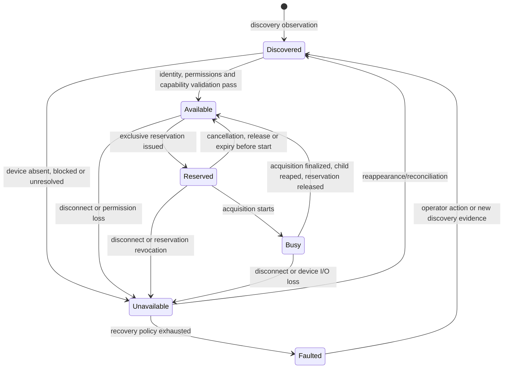
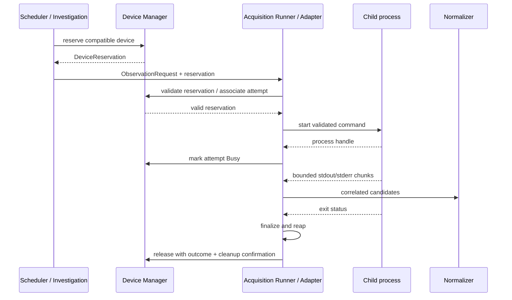
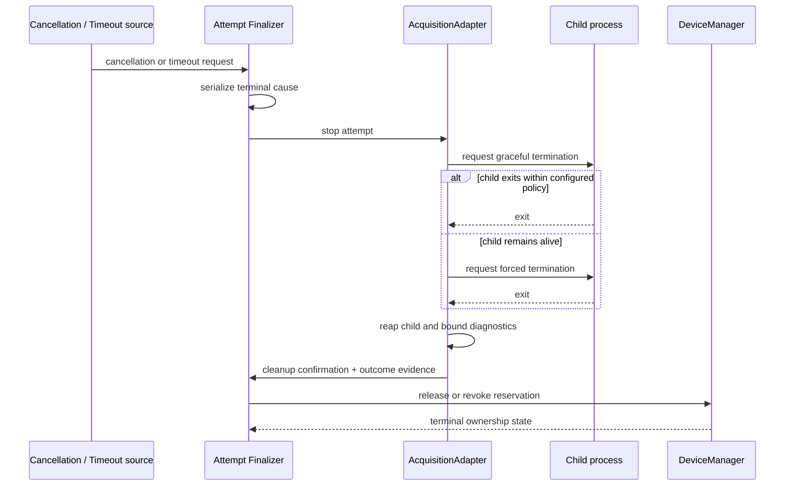
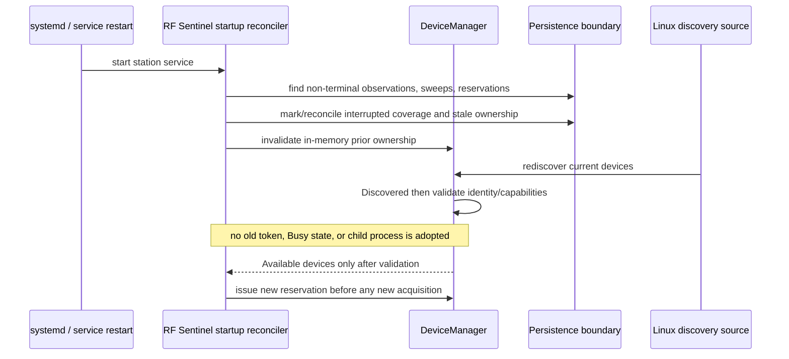

# SDR Device Architecture

## Scope, constraints, and relationship to the system architecture

This document specifies the SDR device-layer contracts and lifecycle semantics for RF Sentinel. It refines the accepted Device Manager and Acquisition Adapter boundaries in [ARCHITECTURE.md](../ARCHITECTURE.md); it does not change accepted ADRs, choose persistence technology, create production interfaces, or add transmit capability.

The scope is RX-only spectrum observation on Raspberry Pi CM4/Linux ARM64 with RTL-SDR and HackRF as initial hardware. `rtl_power` and `hackrf_sweep` remain experimental acquisition baselines. SoapySDR remains an evidence-gated future adapter. Hardware-dependent values are deliberately absent and remain governed by [EXPERIMENTS.md](../research/EXPERIMENTS.md) and the architecture questions referenced below.

The document separates five categories:

| Category | Defined here | Explicitly not decided here |
| --- | --- | --- |
| **Domain contracts** | Identity, capabilities, reservation, observation request, adapter, attempt, outcome, and error contracts. | Language types, database schemas, package APIs. |
| **Runtime/lifecycle semantics** | State transitions, ownership, subprocess supervision, cancellation, disconnect/reconnect, and restart reconciliation. | Numeric timeouts, retry count, backoff, signal implementation, service-unit details. |
| **Device-specific capability data** | How RTL-SDR and HackRF differences are represented without false parity. | An asserted complete capability matrix or unmeasured performance values. |
| **Policy/configuration** | Which controls are configuration inputs and how they influence behavior. | Final values, operator roles, storage technology. |
| **Experiment-dependent values** | Evidence gates and unresolved questions. | Assumptions treated as deployment facts. |

## Design vocabulary

- **Physical device:** One SDR hardware unit, regardless of its current USB connection location.
- **Device record:** RF Sentinel’s persistent conceptual record of a physical device or an unresolved candidate identity.
- **Connection observation:** A point-in-time Linux/USB sighting of a device; it is not itself a stable identity.
- **Reservation:** An exclusive, non-transferable grant of device-control authority with lease semantics.
- **Lease semantics:** A reservation is valid only while its owner, device identity/state, intended operation, and lifecycle conditions remain valid. It may be revoked by disconnect, expiry, cancellation, or service restart.
- **Acquisition attempt / Sweep:** One concrete execution under a reservation. It has an outcome even when it yields no valid SpectrumMeasurement.
- **Capability requirement:** A hard or evidence-gated requirement derived from an already validated ScanProfile and concrete Observation.

## 1. Domain contracts

### 1.1 `DeviceIdentity`

`DeviceIdentity` describes both the durable identity claim for a physical SDR and the evidence used to reconcile its current connection. It is an immutable identity snapshot within any Observation, Sweep, measurement, event, health record, or reservation; later reconciliation does not rewrite historical provenance.

| Identity element | Role | Stability | Notes |
| --- | --- | --- | --- |
| **RF Sentinel device identifier** | Internal identifier for the device record referenced by domain data. | Stable once a record is established. | It is not derived solely from an OS path and is not a claim that identity evidence was perfect. |
| **Device family/type** | Broad hardware family, initially RTL-SDR or HackRF. | Usually stable, but still evidence-backed. | Used for adapter eligibility and capability interpretation. |
| **Manufacturer/model and hardware revision** | Known device descriptor where observable. | Usually stable. | Supports operator review and capability provenance; it does not uniquely identify identical units. |
| **Hardware serial evidence** | Hardware-reported serial when available, valid, and considered reliable. | Potentially stable. | A strong reconciliation input, not a universal assumption. Its availability/reliability is recorded, not inferred. |
| **Observed Linux/USB identifiers** | Vendor/product IDs, interface descriptors, kernel/driver attributes, and other observed evidence. | Contextual; may be stable in part. | Helps identify family and reconcile an attachment, but may not distinguish identical units. |
| **Current connection/location** | Current devnode, bus/device number, USB topology/path, discovery time, permission state. | Transient. | Never the sole durable physical identity. It may change after reconnect or reboot. |
| **Operator-defined binding/alias** | Explicit logical assignment such as `survey-primary`. | Stable only while configuration says so. | It is a policy/configuration reference, not proof of physical identity. A binding can require operator resolution after replacement/ambiguity. |

#### Stable identity versus connection observation

The internal device identifier plus verified identity evidence defines the *current best-known physical-device record*. Linux bus numbers, device nodes, and connection path identify a current attachment only. They must not silently create a new physical-device record or prove that a reconnect is the same device.

| Situation | Reconciliation behavior |
| --- | --- |
| Same physical device reconnects with matching strong stable evidence, such as a reliable serial and compatible family/model. | Reattach the new connection observation to the existing device record; invalidate old reservations; revalidate capabilities before Available. |
| Known device appears at a different USB path. | Treat path change as expected connection change, not replacement, only when other identity evidence safely supports the existing record. |
| Identical models have distinct reliable serials. | Maintain distinct device records; aliases/bindings may select one explicitly. |
| Serial is missing, generic, invalid, or unreliable. | Do not infer sameness from model or transient path alone. Reconcile only through sufficiently configured evidence/operator binding; otherwise mark identity ambiguous and prevent automatic reservation. |
| Replacement hardware appears. | Create a candidate/new record unless explicit operator resolution authorizes a binding change. Historical records keep the prior device identifier and evidence snapshot. |
| Discovery evidence matches more than one existing record, or one record conflicts with observed family/serial evidence. | Enter/retain unresolved discovery state, raise a health/identity error, and require configuration or operator resolution. No new reservation is issued. |
| Two simultaneously present connections claim the same supposedly unique identity evidence. | Treat as conflicting/duplicate identity evidence, do not reserve either affected candidate automatically, and retain diagnostic evidence for review. |

RF Sentinel may automatically treat a rediscovery as the same physical device only when the configured reconciliation policy finds non-conflicting, sufficient stable evidence. The final Linux/udev identity algorithm and permission model remain **AQ-04**; this design deliberately does not invent one.

### 1.2 `DeviceCapabilities`

`DeviceCapabilities` is a device-neutral description of what may be requested, what a particular adapter reports it can do, and what has been validated for the deployed CM4 environment. It is not a common setting set that asserts RTL-SDR and HackRF are equivalent.

Each capability assertion includes a **value or constraint**, an **evidence source**, a **status**, and an optional **limitation/diagnostic reference**.

| Capability category | Examples of represented information | Must remain explicit |
| --- | --- | --- |
| Frequency and tuning | Supported/tentative frequency coverage, tuning granularity/constraints, known excluded regions, sweep geometry constraints. | Source and device/adapter-specific units/limits; no implied cross-device calibration. |
| Acquisition mode | Sweep, continuous spectrum/stream, optional future IQ capture, one-shot/bounded operation. | Whether mode is hardware, adapter, or deployment validated. |
| Sample rate / bandwidth / resolution | Supported setting forms or constraint sets, not assumed universal numbers. | Hardware capability versus adapter-accepted setting versus sustainable CM4 profile. |
| Gain and signal controls | Available gain controls, names, modes, units/semantics when known. | No normalization that suggests equal gain behavior across families. |
| Device selection and metadata | Serial selection, index/path selection, adapter selection mechanism, timestamps/actual-setting metadata where available. | Ambiguity and reliability of selection mechanism. |
| Adapter support | Adapter identifier/version and supported device family/operation descriptor. | A tool’s support does not automatically prove deployment readiness. |
| Operational/deployment constraints | Allowed concurrent operation, long-run stability, USB/power/cooling constraints, supported profile envelope. | These are experiment-derived and may be Unknown/Unvalidated. |

#### Capability evidence layers

| Layer | Meaning | Example use |
| --- | --- | --- |
| **Hardware property** | Reported/documented property of a device family or identified unit. | A device advertises a serial, or a family is known to expose a gain control. |
| **Adapter/tool property** | Property reported or imposed by an AcquisitionAdapter and its external tool/library version. | A tool accepts a particular selector or emits a defined output field. |
| **Deployment validation** | A property demonstrated under recorded RF Sentinel CM4 hardware/software/profile conditions. | A profile/tool/device combination is stable through the required experiment. |

Every assertion uses one of these status values:

| Status | Meaning |
| --- | --- |
| **Supported** | Evidence at the relevant layer affirms it. Hardware/adapter support alone does not imply sustainable deployment support. |
| **Unsupported** | Evidence says the requirement cannot be met for this device/adapter combination. |
| **Unknown** | RF Sentinel lacks sufficient information; it must not assume support. |
| **Adapter-dependent** | Result differs by adapter/version or is meaningful only through a named adapter. |
| **Experimentally unvalidated** | Plausible/configured but not demonstrated in the target CM4 deployment envelope. |

The capability record itself may be updated by discovery or validation, but a capability snapshot/reference used for a reservation or Sweep is immutable provenance.

### 1.3 `DeviceCapabilityRequirement` and deterministic matching

An Observation derives a concrete `DeviceCapabilityRequirement` from immutable configuration and scheduling intent. It does not include all ScanProfile fields; it states only what device/acquisition eligibility needs to prove.

Typical requirements include device family or explicit logical binding, frequency geometry, acquisition mode, required adapter class, requested settings, whether particular actual-setting/metadata evidence is required, and whether optional investigation/IQ capability is needed.

`match(device, requirement) -> CapabilityMatchResult` is deterministic for the same device capability snapshot, adapter descriptor, requirement, and deployment-policy version. It returns more than a boolean:

| Result status | Meaning | Scheduling/reservation effect |
| --- | --- |
| **Compatible** | All hard requirements are supported and policy permits use. | Candidate is eligible, subject to availability/reservation. |
| **Incompatible** | A hard requirement conflicts with known device or adapter capability. | Reject this candidate; the Observation may try another eligible device or record an actionable unsatisfied requirement. |
| **Unvalidated** | No known conflict, but deployment evidence required by policy is absent. | Ineligible for production use unless a configuration explicitly permits experimental execution; never silently treated as Compatible. |
| **Indeterminate** | Capability data is unknown, stale, missing, ambiguous, or adapter-dependent without a selected applicable adapter. | Do not reserve automatically; require discovery/configuration/operator resolution. |
| **Policy denied** | Device may be technically compatible but is disabled, not bound, reserved for another role, or concurrency policy denies use. | Candidate is ineligible for this request; not a hardware mismatch. |

The result contains: candidate `DeviceIdentity` reference; considered capability/adapter snapshots; the selected or rejected adapter; all reasons; missing capabilities; conflicting settings; experiment/evidence gates; and an actionable resolution category.

Matching is evaluated in this order:

1. Confirm the device record has unambiguous identity and is eligible for use.
2. Apply explicit configured device/binding/family requirements.
3. Select or verify an adapter capable of the requested operation and device family.
4. Check frequency geometry, mode, selection requirement, and every hard requested setting against adapter and device constraints.
5. Check target-deployment validation and concurrency policy.
6. Return the most restrictive outcome plus every applicable reason; do not alter the requested operation to make it fit.

Known incompatibilities reject an Observation/device pairing immediately. An unvalidated or indeterminate capability makes a device ineligible for ordinary scheduled work, preserves the blocked reason, and requires policy/configuration/operator action before experimental use. No layer may silently reduce range, change measurement semantics, select a different device, or omit requested provenance.

### 1.4 `DeviceState`

The existing architecture states are retained without semantic replacement. Failure detail is modeled as transition reason/health state, not as extra convenience states.



| State | Meaning | Permitted transitions / triggers | Ownership and new reservations | Health implication |
| --- | --- | --- | --- | --- |
| **Discovered** | A physical connection/candidate record has been observed but identity, permission, and applicable capability validation are incomplete. | To Available after all required validation; to Unavailable when absent, blocked, or unresolved. | No active reservation; no new reservation. | Informational while startup/reconnect validation is active; degraded/error if unresolved beyond policy. |
| **Available** | Identified, permitted, capability-validated device eligible under policy and not reserved. | To Reserved on exclusive grant; to Unavailable on disconnect/permission loss. | No owner; one new reservation may be issued atomically. | Healthy/ready. |
| **Reserved** | A valid exclusive reservation exists but acquisition has not entered Busy. | To Busy when adapter start is accepted; to Available on cancellation/release/expiry; to Unavailable on disconnect/revocation. | Reservation owner has exclusive authority; no second reservation. | Busy-pending/expected state; delayed start is observable. |
| **Busy** | Adapter is executing or finalizing an acquisition attempt under the reservation. | To Available only after attempt finalization, child cleanup where applicable, and release; to Unavailable on disconnect/device loss. | Reservation owner remains exclusive; no new reservation. | Active observation. Adapter/process fault appears as health error and a final attempt outcome, not a new state. |
| **Unavailable** | Device is absent, permission-blocked, identity-ambiguous, disconnected, or otherwise not eligible now. | To Discovered on reappearance/reconciliation; to Faulted when bounded recovery is exhausted. | No valid reservation; no new reservation. | Degraded/error; missed/deferred coverage is explicit. |
| **Faulted** | Recovery policy has exhausted automatic action or integrity requires operator attention. | To Discovered only after operator action or new reconciliation evidence. | No valid reservation; no new reservation. | Persistent fault; configured notification and operator review. |

Transition rules for required events:

- **Startup:** each observed connection begins Discovered; no device is implicitly Available because it existed before restart.
- **Reservation:** Device Manager alone transitions Available → Reserved after a successful compatible match and exclusive grant.
- **Acquisition start:** adapter validates the reservation; Device Manager records Reserved → Busy only for the corresponding attempt. A child-start failure finalizes the attempt and releases/revokes without a false successful Busy outcome.
- **Completion/cancellation/expiry:** the attempt finalizer serializes the terminal result. Busy returns to Available only after required cleanup; Reserved can return to Available when no attempt began.
- **Subprocess failure/malformed output:** device may remain physically usable, so finalization normally returns Busy → Available after cleanup while Health records adapter failure. Repeated recovery failure can lead to Unavailable/Faulted under policy.
- **Disconnect:** transitions to Unavailable revoke active ownership immediately; a physical reconnect must traverse Discovered.
- **Service restart:** in-memory reservations do not survive; reconciliation identifies incomplete work, then rediscovery starts at Discovered.

### 1.5 `DeviceReservation` with lease semantics

The selected term is **DeviceReservation**, qualified as **with lease semantics**. “Reservation” clearly expresses exclusive device allocation; “lease semantics” expresses expiry/revocation without implying distributed or cryptographic leasing in an initial in-process trust boundary.

| Reservation element | Meaning |
| --- | --- |
| Reservation identifier/token | Opaque correlation and validation reference, unique within the station lifecycle and persistable as audit/provenance when needed. It is not designed here as a cryptographic credential. |
| Physical device reference | RF Sentinel device identifier plus immutable identity/capability snapshot reference. |
| Requesting owner | Scheduler or Investigation Manager instance/context that owns this acquisition intent. |
| Intent | Observation identifier and Survey or Investigation purpose; optional RFEvent/investigation reference where applicable. |
| Capability-match reference | Match result, selected adapter, policy/configuration version, and reasons supporting the grant. |
| Lifecycle context | Creation time, validity/expiry conditions, cancellation handle/context, current status, and revocation/finalization reason if terminal. |
| Attempt association | Once started, the associated Sweep/acquisition-attempt identifier and Adapter identifier/version. |

#### Reservation invariants

1. At most one non-terminal reservation may exist for one reconciled physical SDR at a time.
2. Device Manager is the only reservation authority. An adapter receives an already assigned device and cannot discover/select/substitute another SDR.
3. A reservation is non-transferable: owner, intent, device record, selected adapter, and capability-match context cannot be changed in place.
4. Validation requires a matching non-terminal reservation identifier, owner/intent correlation, device identity reference, state (`Reserved` or `Busy` as appropriate), and non-revoked/non-expired lifecycle context.
5. Disconnect, identity conflict, service restart, or explicit revocation invalidates the reservation immediately. Reconnect cannot resurrect it.
6. For a started subprocess acquisition, final release occurs only after the attempt finalizer has ordered graceful/forced termination as needed and reaped the owned child. If device loss prevents normal tool behavior, cleanup still runs before the reservation becomes terminal.
7. Release of an unknown, revoked, expired, or already terminal reservation is deterministic and idempotent: it does not affect another reservation, returns a terminal/no-op result, and records a diagnostic/audit outcome where appropriate.
8. Cancellation and expiry contend through one serialized finalizer. Exactly one terminal reservation status and one terminal attempt outcome is persisted; other concurrent signals are recorded as contributing diagnostics.

### 1.6 `DeviceManager` contract

**Responsibilities:** DeviceManager owns discovery/inventory, identity reconciliation, capability records, availability state, exclusive reservation issuance/validation/revocation/release, lifecycle transitions, and reconnect reconciliation.

**Non-responsibilities:** It does not own RF detection/event policy, scheduling policy, Telegram, measurement/event persistence, subprocess parsing, PSD normalization, report generation, or a final device driver implementation. It grants authority; the Adapter owns tool/API execution.

| Conceptual operation | Inputs | Result | Major errors | State / idempotency expectations |
| --- | --- | --- | --- | --- |
| **Reconcile discovery** | Current connection observations, identity-policy/configuration context. | New/updated device records, reconciliation result, transitions. | Identity conflict/ambiguity, permission discovery failure. | Idempotent for the same observation set; may enter/retain Discovered or Unavailable; never grants a reservation. |
| **List/get inventory** | Query/filter context. | Device record, connection/health state, capability summary, active reservation summary. | Unknown device reference. | Read-only, consistent snapshot semantics defined later. |
| **Evaluate capability** | Device record/capability snapshot, `DeviceCapabilityRequirement`, adapter/policy version. | `CapabilityMatchResult`. | Stale/missing capability data, unknown adapter. | No state change; deterministic for fixed inputs. |
| **Reserve eligible device** | Observation intent, capability requirement, eligible binding/family rules, policy version. | One DeviceReservation or a reasoned no-eligible-device result. | Reservation conflict, capability mismatch/unvalidated/indeterminate, policy denied. | Atomic Available → Reserved for exactly one compatible device; repeat requests use caller idempotency/correlation to avoid duplicate grants. |
| **Reserve configured device** | Specific internal device/binding plus Observation intent/requirement. | Reservation or reasoned rejection. | Device unavailable, identity ambiguous, mismatch, conflict. | Does not silently fall back to a different device unless the request expressly permits fallback. |
| **Validate/mark acquisition started** | Reservation token, owner/attempt/adapter identity. | Validated grant and Busy transition acknowledgement. | Stale/invalid/revoked reservation, adapter mismatch, wrong device, state conflict. | Idempotent only for the same reservation/attempt start; no second attempt may be attached. |
| **Release after finalization** | Reservation token, terminal attempt outcome, cleanup confirmation. | Terminal reservation/release result. | Invalid correlation, cleanup incomplete, invariant violation. | Idempotent for the same terminal outcome; Busy → Available only once all release conditions hold. |
| **Revoke** | Reservation token, reason such as disconnect/cancellation/expiry/service restart. | Revocation acknowledgement and transition. | Unknown already-terminal reservation is a deterministic no-op. | Idempotent; prevents later start/ownership extension. |
| **Report adapter/device failure** | Reservation/attempt reference, normalized error category, evidence. | Health/lifecycle transition or recovery request input. | Inconsistent attempt/reservation reference. | Does not parse tool output or decide retry count; repeated reports are deduplicated by correlation. |
| **Process disconnect/reconnect** | Connection-loss or discovery event. | Revocation/reconciliation result and state transition. | Ambiguous identity, duplicate evidence. | Disconnect processing is idempotent; reconnect starts a new discovery/reconciliation cycle. |

### 1.7 `ObservationRequest`

An `ObservationRequest` is one concrete unit of acquisition work derived from validated configuration and scheduling intent. It is not a mutable ScanProfile and does not duplicate unrelated schedule, detector, report, or retention policy.

| Required element | Meaning |
| --- | --- |
| Observation identifier and correlation identifiers | Identifies this planned/actual work and connects scheduler, reservation, attempt, source records, health, and logs. |
| Intent | Survey or Investigation; Investigation includes the permitted RFEvent/investigation reference. |
| Immutable ScanProfile and ConfigurationVersion references | Establish the configuration provenance, without copying entire mutable documents. |
| Requested frequency geometry | Requested range/span/bin or resolution intent expressed with explicit semantics. |
| Requested acquisition/measurement settings | Only settings relevant to the concrete attempt, including required mode and evidence/quality requirements. |
| Timing context | Scheduled/planned time, deadline/timeout-policy reference, and cancellation context. No numeric threshold is defined here. |
| Device selection/capability requirement | Specific logical binding/device reference where configured, or the requirement used by DeviceManager to choose a device. |
| Selected reservation reference | Attached only after DeviceManager grants a reservation; the request itself cannot grant authority. |

Requested settings are immutable intent. **Actually applied settings** are captured by the Adapter in the Sweep/acquisition outcome and normalized measurement provenance: actual device identity, adapter/tool/library version, actual time bounds, actual gain/rate/geometry/mode where known, output-quality flags, and any setting the tool reports as changed/unknown. The Adapter must not retroactively mutate an ObservationRequest to conceal a difference.

### 1.8 `AcquisitionAdapter`

An `AcquisitionAdapter` is device/tool-neutral. It verifies that it can operate the already-assigned device under the request, starts and supervises an implementation-specific acquisition, incrementally translates raw output into normalized-measurement candidates or adapter records, and reports lifecycle/error/cancellation outcomes.

It **must not** discover/select another SDR, issue or extend reservations, create RFEvents, apply detector policy, write analytics, call Telegram, or silently reinterpret unsupported settings.

| Adapter contract element | Meaning |
| --- | --- |
| Adapter descriptor | Adapter identifier/type, adapter version, external tool/library version, supported device-family/operation descriptor, input/output semantics, and known adapter limitations. |
| Eligibility check | Given the assigned device capability snapshot and ObservationRequest, returns Compatible/Incompatible/Unvalidated/Indeterminate with reasons. It cannot make a reservation. |
| Start | Accepts only a valid current reservation and a request whose selected adapter matches. Creates an AcquisitionAttempt/Sweep correlation and invokes the implementation. |
| Candidate emission | Emits bounded, ordered raw/translated candidates with attempt/reservation correlation to the Measurement Normalizer; normalizer remains the authority for SpectrumMeasurement validity. |
| Lifecycle events | Reports started, output accepted/rejected by parser, partial progress where meaningful, cancellation observed, timeout, device loss, exit, cleanup, and terminal outcome. |
| Stop/cancel | Responds to cancellation/revocation/timeout by ending owned work and participating in finalization. It cannot release a reservation independently. |

Initial adapter names may be `RTLPowerAdapter` and `HackRFSweepAdapter`. Future `SoapySDRAdapter` and native-API adapters implement the same conceptual boundary only after their evidence gates. The interface does not require a subprocess; an in-process stream adapter has the same reservation, attempt, candidate, outcome, cancellation, and provenance obligations.

### 1.9 `AcquisitionAttempt` / `Sweep` and `AcquisitionOutcome`

An AcquisitionAttempt (the concrete `Sweep` domain relationship in the system architecture) is created for every started acquisition implementation. It is distinct from emitted SpectrumMeasurements and always finalizes with an `AcquisitionOutcome`.

| Outcome status | Meaning and coverage semantics |
| --- | --- |
| **Complete** | Attempt completed its requested acquisition according to adapter semantics and produced one or more valid measurements. This is not a claim that every RF transmission was observed. |
| **Partial** | Some acquisition/valid measurements occurred, but requested coverage was incomplete or quality-limited. Retain valid source data and explicit limitation. |
| **Failed** | Attempt could not complete due to a categorized adapter/device/internal failure. No invented measurement fills missing coverage. |
| **Cancelled** | Authorized cancellation or schedule/policy cancellation finalized before complete outcome. Any valid prior measurements remain, marked with their actual coverage. |
| **Timed out** | Deadline/policy timeout caused termination/finalization. It may retain prior valid measurements as partial, but the attempt outcome remains Timed out. |
| **Device lost** | Disconnect/device loss invalidated ownership. Prior valid records remain; remaining coverage is explicitly failed/unavailable. |
| **Invalid output** | Required output was malformed/ambiguous/inconsistent such that no affected candidate could be normalized. This may coexist with a partial outcome when earlier valid measurements exist. |
| **No valid measurements** | Terminal result modifier/reason: the attempt produced no valid normalized SpectrumMeasurement. It never means quiet RF spectrum. |

Every outcome includes Observation and Sweep identifiers; reservation and physical-device identity snapshot; adapter/tool/library version; start/end timestamps and time basis; requested versus actual settings reference; terminal status; error category/retryability; valid/invalid candidate counts where meaningful; coverage/quality description; diagnostic references; and finalization/cleanup state. It is persisted through the existing coverage/Sweep outcome boundary independent of final measurement count.

## 2. Runtime and lifecycle semantics

### 2.1 Generic acquisition lifecycle

The lifecycle coordinator serializes terminal events for one reservation/attempt. It follows this conceptual sequence:

1. Scheduler or Investigation Manager obtains a Compatible reservation from DeviceManager.
2. Acquisition Runner selects the reservation’s named adapter and asks it to verify the assigned device/request pair; it may not substitute a device.
3. Adapter constructs implementation input only from validated request/configuration and reservation context.
4. Adapter asks DeviceManager to validate the still-current reservation and associate a new Sweep/attempt before starting work.
5. Adapter starts its implementation. On successful child/API handle creation, DeviceManager records Reserved → Busy for that attempt. During start, Reserved remains exclusive, so no competing acquisition can begin.
6. Adapter consumes output incrementally or in bounded units, retains stderr/diagnostics within policy bounds, and emits candidates with correlation/provenance.
7. Measurement Normalizer accepts or rejects candidates independently; an invalid candidate never becomes a SpectrumMeasurement.
8. Completion, cancellation, timeout, disconnect, process exit, malformed output, or failure is submitted to one finalization path.
9. Finalizer stops work where needed, confirms child/API cleanup, emits exactly one terminal AcquisitionOutcome plus coverage state, and asks DeviceManager to release or revoke ownership.
10. Health/Recovery Controller receives categorized outcome and decides later retry/reschedule policy; Adapter and DeviceManager do not choose retry counts.

### 2.2 Cancellation, timeout, and terminal-race semantics

Cancellation, timeout, device loss, and normal completion may race. The coordinator uses a single serialized finalization decision associated with the attempt. It records monotonically ordered lifecycle observations (the precise clock source is an open timing question) and never emits two terminal outcomes.

- If a valid complete exit is observed and finalized before cancellation/revocation is accepted, the outcome is Complete/Partial as applicable; later cancellation is a no-op diagnostic.
- If cancellation is accepted before normal completion is finalized, the adapter begins cancellation and the terminal outcome is Cancelled unless a higher-integrity device-loss condition is observed.
- If the timeout policy is reached before completion is finalized, the adapter begins cancellation and the terminal outcome is Timed out unless device loss is observed.
- Device disconnect/revocation invalidates ownership immediately. Device lost takes precedence over an unfinalized normal/cancel/timeout result because no later output may be attributed with valid device ownership.
- Multiple causes are retained as diagnostics. Status precedence is for a deterministic primary outcome only; it does not hide the cancellation/timeout/process-exit evidence.

No timeout duration, grace interval, force-termination delay, retry count, or backoff is set here. These are policy values blocked by **AQ-10** and the recovery/endurance experiments.

### 2.3 Initial subprocess supervision contract

`RTLPowerAdapter` and `HackRFSweepAdapter` use the generic adapter contract but additionally own a child-process lifecycle. The **Acquisition Runner/Adapter owns the child process**. The **DeviceManager owns the SDR control authority/reservation state**. The responsibilities must not be collapsed.



For each attempt, the adapter must:

1. Validate reservation identity, ownership, status, selected adapter, and expiry/revocation status.
2. Construct a command from validated ObservationRequest settings; shell interpolation and arbitrary command input are outside the contract.
3. Start one owned child process (and, where applicable, an owned process group/tree boundary suitable for cleanup).
4. Retain a process handle/correlation before accepting output; change to Busy only for that attempt after successful start handling.
5. Consume stdout and stderr without unbounded buffering. Parse output incrementally or as bounded batches; preserve a truncation/overflow diagnostic rather than consuming unbounded memory/disk.
6. Attach every raw line/chunk/candidate to the attempt and adapter/tool version before parsing. Tool-specific exit codes remain adapter diagnostics, not domain errors.
7. Observe normal exit status and distinguish clean completion from early exit, parser failure, cancellation, timeout, device loss, and startup failure.
8. On cancellation/timeout/revocation, request graceful termination where the implementation allows; after a policy-defined bounded grace, request forced termination if still alive.
9. Reap the child in all terminal paths, including startup races, parser failures, cancellation, disconnect, and service shutdown. A child process is not considered cleaned merely because output stopped.
10. Finalize the Sweep/AcquisitionOutcome and only then release/revoke reservation according to the finalizer rule.

Cleanup/reaping failure is an explicit error category and health condition. It cannot permit a new reservation if there is any possibility that the old child still controls the SDR. The DeviceManager may retain the device Unavailable/Faulted until cleanup/identity safety is restored.

### 2.4 Disconnect and reconnect

| When loss is observed | Required behavior |
| --- | --- |
| **Available** | DeviceManager transitions Available → Unavailable, records connection-loss state, and issues no new reservation. |
| **Reserved, not Busy** | DeviceManager atomically revokes the reservation and transitions Reserved → Unavailable. The Observation cannot start with stale ownership; Scheduler records deferred/failed coverage and may later reschedule under policy. |
| **Busy** | DeviceManager immediately invalidates reservation authority and transitions Busy → Unavailable. Adapter is instructed to stop/reap its child/API work. Finalizer records Device lost (or Partial evidence plus Device lost) and explicit coverage failure. No post-disconnect output can be attributed as valid new measurement. |
| **Reconnect** | New connection observation enters Discovered. DeviceManager reconciles identity, rechecks permissions/presence, refreshes/revalidates capability records, and reaches Available only if all gates pass. It never inherits reservation, Busy status, child process, or attempt ownership. |

#### Concurrent-event rule

Disconnect can race with start, cancellation, normal exit, expiry, or cleanup. The DeviceManager/reconciliation path is authoritative for device presence; the attempt finalizer is authoritative for terminal attempt result. Both operate on the same reservation/attempt correlation under serialized transition rules:

- A disconnect received before Busy is committed revokes Reserved and causes a rejected/no-start attempt outcome.
- A disconnect after child start but before Busy acknowledgement still invalidates the reservation; adapter cleanup runs and the terminal outcome is Device lost or failed-start-with-device-lost evidence, never Complete.
- A normal child exit and disconnect arriving together cannot recreate availability without rediscovery. If disconnect has been recorded before finalization, Device lost is primary; otherwise a completed attempt may finalize, but the device immediately moves from Available to Unavailable and no new reservation is issued.
- Cancellation/expiry after disconnect is a no-op for ownership but remains diagnostic. Reconnect always uses a new reconciliation cycle.

### 2.5 Service restart and reconciliation

The accepted runtime is one systemd-supervised station service with supervised acquisition child processes. After station-service restart:

- No in-memory reservation token, adapter handle, Busy state, or child PID from the prior process is automatically valid.
- Any persisted non-terminal Observation/Sweep/reservation audit record is reconciled as interrupted/unknown-finalization until evidence establishes its terminal state. It must not be reported as quiet coverage.
- Devices are rediscovered and revalidated from Discovered. New acquisition requires a newly issued reservation.
- The service must not adopt a residual process merely because its name, PID, or command resembles an acquisition tool. Deployment must provide a supervised containment/cleanup arrangement for station-owned children; if positive cleanup/ownership cannot be established, the affected device remains unavailable for operator/recovery handling.
- Restart reconciliation must release/revoke stale logical ownership before a new device grant and record restart-related coverage/health evidence.

To support reconciliation without selecting a store, the eventual persistence boundary needs durable references for: Observation and Sweep identifiers/status/timestamps; reservation identifier/device identity/owner/intent/terminal reason; configuration/profile/adapter version; lifecycle/cleanup correlation; emitted measurement counts and coverage status; and health/recovery episode references. This is a required information category, not a database schema or technology choice.

## 3. Device-specific capability data

Initial support must expose real differences rather than present an artificial universal SDR model.

| Difference | RTL-SDR / `rtl_power` | HackRF / `hackrf_sweep` | Architecture classification |
| --- | --- | --- | --- |
| Baseline acquisition path | `rtl_power` is the experimental RTL-specific sweep/FFT logger baseline and emits CSV-style sweep data. | `hackrf_sweep` is the experimental HackRF-specific sweep baseline with its own output/controls. | **Adapter-specific implementation detail** at raw edge; normalized contract exposes only valid common semantics. |
| Device family and adapter eligibility | RTL-SDR family only; profile/adapter must not be used for HackRF. | HackRF family only; profile/adapter must not be used for RTL-SDR. | **Must be exposed as capability.** |
| Device selection | Exact identity/selection behavior for target RTL-SDR units and tool version must be verified. | Tool documentation exposes serial selection where available; deployment reliability still requires validation. | **Must be exposed as capability** plus **experiment required** for identity/selection behavior. |
| Gain, tuning, sample/acquisition settings | Device/tool-specific gain, tuner, sample-rate, and sweep behavior must remain named/provenanced. | Device/tool-specific amplifier/LNA/VGA, sweep, and geometry behavior must remain named/provenanced. | **Measurement provenance** and **must be exposed as capability**; no shared gain semantic is invented. |
| Sweep geometry/output semantics | Tuning hops, bin/integration output, and CSV parser assumptions belong to RTL adapter/normalizer. | Sweep ranges, bin width, chunk/retune behavior, and output parser assumptions belong to HackRF adapter/normalizer. | **Adapter-specific implementation detail**; any impact on usable bins/coverage becomes **measurement provenance**. |
| Stable long-running/recovery behavior | Tool/device/USB behavior is not assumed from software availability. | Tool/device/USB behavior may differ and is not assumed equivalent. | **Experiment required.** |
| Continuous stream/future IQ support | Must not be inferred merely from sweep wrapper support. | Must not be inferred merely from sweep wrapper support. | **Must be exposed as capability** and **experiment required** before optional use. |
| Detector/analytics/Telegram | No device-specific detector or report behavior should leak downstream of normalized measurements and quality/provenance. | Same. | **Not relevant downstream** except through normalized measurement, coverage, and provenance. |

Facts such as exact selectable parameters, tool versions, full frequency coverage, selection reliability, and performance must be taken from the selected device/tool/version’s controlled validation record. This document does not assert numeric limits or calibrated equivalence.

## 4. Policy and configuration inputs

Policy/configuration supplies values to the contracts; it does not override a known incompatibility or create a capability.

| Policy/configuration area | Effect on device layer | Evidence/guardrail |
| --- | --- | --- |
| Device binding/alias and identity-reconciliation policy | Maps approved logical roles to a device record/evidence policy; resolves replacement/ambiguous device decisions. | AQ-04; no transient USB path as sole identity. |
| Profile-derived device requirements | Selects family/adapter requirements, frequency geometry, required acquisition mode/settings, and allowed fallback behavior. | Capability matcher rejects silent downgrade/substitution. |
| Adapter enablement/version allowlist | Determines which adapter/tool versions may be selected. | `rtl_power`/`hackrf_sweep` baseline remains experimental; SoapySDR is evidence-gated. |
| Deployment validation policy | Defines whether Unvalidated capability results are prohibited or explicitly allowed for controlled experiments. | Normal scheduled production monitoring must not silently enable unvalidated behavior. |
| Reservation/timeout/cancellation policy | Supplies lease expiry, deadlines, graceful/forced termination timing, queue/cancellation semantics. | Values remain AQ-10/experiment-derived. |
| Retry/recovery policy | Supplies bounded retry/backoff, recovery-exhaustion and operator-escalation behavior. | DeviceManager reports facts; Health/Recovery Controller applies policy. |
| Concurrency and investigation policy | Determines whether distinct SDRs may run concurrently and whether an investigation may use/preempt survey capacity. | AQ-05 and AQ-14; no concurrency assumption. |
| Logging/diagnostics retention policy | Bounds stdout/stderr/raw-output diagnostics and protects secrets. | No unbounded buffering; logs never replace structured provenance. |

## 5. Error taxonomy

Adapters map tool/API-specific conditions to this small architecture-level taxonomy. Raw exit codes, parser text, and OS errors remain attached as bounded diagnostics but do not leak as domain API categories.

| Category | Class | Typical disposition | Notes |
| --- | --- | --- | --- |
| **Identity error** | Configuration/identity | Require reconciliation or operator action. | Includes ambiguous, conflicting, or replacement evidence. |
| **Device absent / unavailable** | Hardware/device | Retry discovery/recovery under policy; degrade affected work. | No reservation issued. |
| **Capability mismatch** | User/configuration | Reject request/device pairing. | Known unsupported required setting/family/mode. |
| **Capability unknown or unvalidated** | Evidence/configuration | Ineligible unless controlled experimental policy permits. | Never silently equivalent to supported. |
| **Reservation conflict** | Operational/concurrency | Defer or choose another eligible device according to request policy. | One device already reserved/busy. |
| **Stale/invalid reservation** | Lifecycle/internal boundary | Reject start/release action; record diagnostic. | Never grants ownership. |
| **Device disconnected** | Hardware/device | Revoke, cleanup, record coverage failure, rediscover. | Retryability determined by policy after rediscovery. |
| **Adapter unsupported** | Configuration/adapter | Reject request/adapter pairing. | Adapter cannot meet requested operation. |
| **Adapter/tool startup failure** | Adapter/tool | Cleanup any partial start; retry/degrade under policy. | Includes execution/permission/start handle failure. |
| **Timeout** | Operational | Cancel/cleanup and record timed-out outcome. | Timeout values are policy-defined. |
| **Cancellation** | Control/lifecycle | Cleanup and record cancelled outcome. | Not inherently an error. |
| **Malformed output** | Adapter/tool/data quality | Reject affected candidates; possibly partial outcome; retry/degrade based on pattern. | No fake normalization. |
| **Device I/O/acquisition failure** | Hardware/device or adapter | Finalize failed/partial; reconnect/recovery policy decides next action. | Preserve actual evidence. |
| **Cleanup/reaping failure** | Operational/internal | Keep affected device unavailable/faulted until safety restored. | Prevents double control. |
| **Internal invariant violation** | Internal software | Fail safe, stop affected work, health escalation/service recovery. | Must be observable and never converted into a quiet result. |

Retryability is a category hint, not a retry directive. The Health and Recovery Controller owns bounded retry/backoff/notification policy.

## 6. Concurrency and race invariants

1. One reconciled physical SDR has no more than one active Reservation at any time.
2. Separate physical SDRs may conceptually be reserved concurrently, but deployment concurrency is disabled/allowed only by explicit policy and **AQ-05** evidence; the model does not enable it by itself.
3. DeviceManager alone grants, validates, revokes, and releases device authority.
4. An adapter cannot start without a valid reservation and cannot extend ownership after revocation/expiry.
5. An adapter cannot select or substitute another SDR.
6. Reconnect cannot restore an old reservation, Busy state, or child process ownership.
7. Completion, cancellation, timeout, disconnect, and expiry resolve to one terminal attempt outcome and one terminal reservation outcome; other simultaneous causes remain diagnostics.
8. Every successfully started child process is eventually reaped or leaves an explicit cleanup-reaping failure that blocks new unsafe ownership.
9. A valid measurement candidate always carries the same physical-device identity/reservation/Sweep correlation as the attempt that emitted it. The normalizer rejects mismatches.
10. No device/profile/adapter mismatch or output-quality ambiguity is silently accepted or downgraded.
11. Failed, cancelled, timed-out, disconnected, and no-data attempts always produce coverage semantics distinct from quiet RF spectrum.

## 7. Hardware-free testing seams

Most device-layer behavior must be deterministic before CM4 hardware testing.

| Test seam | Simulates / asserts | Required scenarios |
| --- | --- | --- |
| **Fake discovery backend** | Current connection observations, identity evidence, permissions, capability reports, and event ordering. | No device; RTL-SDR; HackRF; multiple devices; ambiguous/duplicate identity; path change; capability change; disconnect/reconnect. |
| **DeviceManager dependency fakes** | Clock/lifecycle order, configuration/binding policy, health recorder, reservation store/audit. | Exclusive reservation; specific versus eligible selection; stale token; cancellation; disconnect in Reserved/Busy; reconnect; mismatch; concurrent race. |
| **Fake AcquisitionAdapter** | Adapter eligibility, candidate emission, lifecycle and outcome without an SDR or subprocess. | Complete data; partial data; no valid candidates; malformed output; startup failure; timeout; cancellation; crash; device loss. |
| **Fake process supervisor/child** | Start, output chunks, stderr, exit, graceful terminate, forced terminate, and reap ordering. | Start race; bounded stdout/stderr; normal exit; hung child; cancellation; timeout; disconnect; cleanup failure; reap exactly once. |
| **Normalized candidate/measurement fixtures** | Adapter-to-normalizer provenance and validation inputs. | Valid geometry; invalid geometry; missing references; quality flags; partial coverage; no-data outcome. |
| **Replay/synthetic observation source** | Scheduler-to-adapter requests and persisted history. | Deterministic coverage/event/report fixtures without live RF. |

Fakes make unit/integration tests assert ownership, state, terminal outcome, and cleanup behavior. They do not replace controlled CM4 experiments for USB, RF, thermal, long-running stability, tool behavior, or real device recovery.

## 8. Lifecycle sequence diagrams

### Successful scheduled observation

```mermaid
sequenceDiagram
  participant S as Scheduler
  participant D as DeviceManager
  participant A as AcquisitionAdapter
  participant N as Normalizer
  participant M as Measurement Repository

  S->>D: reserveEligible(requirement, Observation)
  D-->>S: reservation + compatible match
  S->>A: start(request, reservation)
  A->>D: validate and associate attempt
  D-->>A: valid; Reserved
  A->>A: start assigned implementation
  A->>D: mark acquisition started
  D-->>A: Busy
  A->>N: measurement candidates with provenance
  N->>M: valid SpectrumMeasurements
  A->>A: observe normal completion and reap
  A->>D: release(reservation, Complete, cleanup confirmed)
  D-->>S: Available + completed coverage outcome
```

### Reservation conflict or no eligible device

```mermaid
sequenceDiagram
  participant S as Scheduler
  participant D as DeviceManager
  participant H as Health / Coverage

  S->>D: reserveEligible(requirement, Observation)
  D->>D: evaluate identity, capability, policy, availability
  alt compatible but already reserved/busy
    D-->>S: no grant: Reservation conflict
  else no compatible capability
    D-->>S: no grant: Incompatible / Unvalidated / Indeterminate reasons
  end
  S->>H: record deferred or missed coverage; do not fabricate measurement
```

### Device disconnect during acquisition

```mermaid
sequenceDiagram
  participant D as DeviceManager
  participant A as AcquisitionAdapter
  participant P as Child process
  participant F as Attempt Finalizer
  participant H as Health / Coverage

  D->>A: reservation Busy
  Note over A,P: acquisition active
  D->>D: connection-loss observation
  D->>D: revoke reservation; Busy to Unavailable
  D->>A: device lost / revoke
  A->>P: terminate and reap owned process
  A->>F: finalize Device lost with retained valid evidence
  F->>H: explicit partial/failed coverage and health state
  Note over D: reconnect must begin at Discovered
```

### Timeout or cancellation with cleanup



### Reconnect and new reservation

```mermaid
sequenceDiagram
  participant X as Linux discovery source
  participant D as DeviceManager
  participant S as Scheduler
  participant A as AcquisitionAdapter

  X->>D: new connection observation
  D->>D: Discovered; reconcile stable identity
  D->>D: check permissions and capabilities
  alt identity and validation sufficient
    D->>D: Available
    S->>D: reserveEligible(new Observation)
    D-->>S: new reservation
    S->>A: start with new reservation
  else ambiguous or unsupported
    D->>D: Unavailable; record reason
  end
```

### Service restart reconciliation



## 9. Experiment-dependent unresolved values

The device model narrows how evidence will be consumed but does not resolve existing evidence gates:

| Existing question | What this design clarifies | Evidence still required |
| --- | --- | --- |
| **AQ-01** (`rtl_power`) | The tool must satisfy the Adapter, provenance, bounded-output, cleanup, and normalized-candidate contract; failure is observable and replaceable. | CM4 profile sufficiency, cadence, output/quality semantics, long-term and recovery behavior. |
| **AQ-02** (`hackrf_sweep`) | Same adapter contract, while retaining HackRF-specific geometry/gain/selection behavior. | CM4 profile sufficiency, retune/geometry behavior, long-term and recovery behavior. |
| **AQ-03** (SoapySDR) | A future adapter needs no downstream redesign, but must provide capability/lifecycle/identity evidence. | Target module discovery, settings, stream stability, reconnect, package/ABI behavior. |
| **AQ-04** (identity) | Stable identity must be distinct from path; ambiguous evidence blocks automatic reservation. | Real device serial/USB/udev evidence, collision/replacement and permission behavior. |
| **AQ-05** (multi-SDR) | The reservation model can isolate distinct physical devices concurrently, but does not enable deployment concurrency. | CM4 USB/power/thermal/resource and operational need evidence. |
| **AQ-07** (measurement semantics) | Requested and actual settings, adapter/version, geometry, units, and quality must be carried as provenance. | Cross-device/tool comparability, calibration/reference and quality rules. |
| **AQ-10** (recovery policy) | Terminal causes, cleanup, and retryability are explicit; values remain outside contracts. | Timeout, grace, retry/backoff, recovery-exhaustion experiments. |
| **AQ-11** (process isolation) | Child-process ownership/reaping is specified within the accepted single service; later service split remains possible. | Endurance/fault evidence showing whether extra process boundaries are needed. |

No existing architecture question is resolved merely by this software design. No new binding ADR is proposed: the terminology, contracts, and lifecycle detail implement accepted DeviceManager/AcquisitionAdapter/runtime decisions rather than change them.

## 10. Compact contract summary

| Conceptual type/interface | Responsibility | Authoritative owner | Mutable expectation | Main relationships |
| --- | --- | --- | --- | --- |
| **DeviceIdentity** | Captures durable identity claim and connection evidence snapshot. | DeviceManager for current reconciliation; historical records retain snapshots. | Current connection evidence changes; referenced snapshot is immutable. | Referenced by capabilities, reservation, Sweep, measurement, health. |
| **DeviceCapabilities** | Describes hardware, adapter, and deployment-validation capability assertions. | DeviceManager maintains current record; Adapter supplies adapter descriptor. | Current record may refresh; match/reservation snapshot immutable. | Input to capability matching and adapter eligibility. |
| **DeviceCapabilityRequirement** | States concrete device eligibility needs for one Observation. | Derived by Scheduler/Investigation from validated configuration. | Immutable per ObservationRequest. | Input to `match` and reservation. |
| **CapabilityMatchResult** | Explains Compatible/Incompatible/Unvalidated/Indeterminate/Policy denied result. | DeviceManager. | Immutable result/snapshot. | Referenced by reservation and diagnostics. |
| **DeviceState** | Describes availability and exclusive-ownership lifecycle. | DeviceManager. | Mutable only through serialized transitions. | Governs reservation eligibility and health. |
| **DeviceReservation** | Exclusive allocation with lease semantics. | DeviceManager. | Mutable lifecycle; identity/intent/match context non-transferable and immutable. | Binds device, owner, Observation, adapter, and Sweep. |
| **DeviceManager** | Discovery, reconciliation, capability state, reservations, transitions, reconnect. | DeviceManager. | Owns current device/reservation state. | Called by Scheduler/Investigation; validates Adapter start/release. |
| **ObservationRequest** | Concrete acquisition intent derived from configuration/schedule. | Scheduler or Investigation Manager. | Immutable requested intent; reservation attached as derived association. | References ScanProfile, ConfigurationVersion, requirement, timing, intent. |
| **AcquisitionAdapter** | Runs assigned implementation and emits candidates/lifecycle outcomes. | Acquisition Runner/Adapter boundary. | Per-attempt runtime state only. | Requires valid reservation; feeds Normalizer and DeviceManager lifecycle. |
| **AcquisitionAttempt / Sweep** | Records one concrete execution. | Acquisition Runner produces; persistence boundary retains outcome. | Lifecycle mutable until one terminal outcome, then immutable. | Links Observation, reservation, device, adapter, candidates, outcome. |
| **AcquisitionOutcome** | Represents complete/partial/failed/cancelled/timed out/device lost/no-data coverage outcome. | Attempt Finalizer/coverage persistence boundary. | Immutable once terminal. | Explains Sweep/Observation coverage independently of measurements. |
| **Device/acquisition error category** | Stable tool-neutral failure classification and retryability hint. | Producing component normalizes; Health/Recovery applies policy. | Immutable within emitted outcome/health episode. | Drives health, recovery, coverage, and diagnostics. |

## Review checklist

- Stable device identity is separate from transient Linux connection information; AQ-04 remains open.
- Reservations are exclusive, non-transferable, revocable, and cannot survive restart/reconnect.
- `rtl_power` and `hackrf_sweep` are tool-specific adapter implementations only; they do not leak into event/analytics contracts.
- SoapySDR has no premature runtime requirement.
- No numeric timeouts, resource limits, device capability/performance values, or final persistence technology are invented.
- Failed/partial/no-data lifecycle outcomes remain coverage facts, not quiet-spectrum measurements.
- Every child-process terminal path requires bounded output, termination when necessary, reaping, and deterministic reservation finalization.
- Fake discovery, DeviceManager dependencies, adapters, processes, and fixtures enable deterministic lifecycle testing before physical hardware tests.
